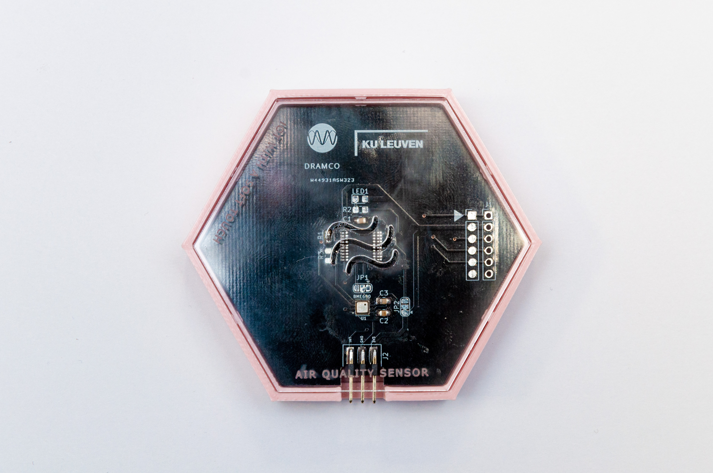

# Environmental Sensor

De luchtkwaliteitssensor meet volgende gegevens:
- Temperatuur (&deg;C)
- Luchtdruk (hPa)
- Relatieve luchtvochtigheid (%)
- Maat voor luchtkwaliteit (Air Quality Index) - zonder eenheid

## Air Quality Index

De luchtkwaliteitssensor bevat een gas sensor dat de hoeveelheid vluchtige organische stoffen kan meten. Vuchtige organische stoffen (VOG's) bestaan uit een brede waaier aan organische stoffen die gasvormig (of vluchtig) zijn bij kamertemperatuur. Voorbeelden zijn alcoholen en ketonen. 
De concentratie gassen wordt gewoonlijk uitgedrukt in parts-per-million (ppm). Als de concentratie 1 ppm is dan wilt dit zeggen dat er per miljoen luchtmoleculen één molecule VOG's aanwezig is.

Vermits de hoeveelheid VOG's in de lucht een rechtstreeks verband hebben met de lokale uitstoot, wordt dit gebruikt om een indicatie van de luchtkwaliteit te verkrijgen. Via een algoritme wordt op basis van de concentratie van deze chemische stoffen, de temperatuur en luchtvochtigheid een indicatie van de luchtkwaliteit berekend. 

Toepassingen:
- Monitoring klaslokalen
	* Bv. signaleren wanneer het tijd is om klaslokalen te verluchten
	* Bv. effect van ligging klaslokaal op temperatuur
	* Bv. effect van initiatieven als dikke truiendag op temperatuur in de klas
- Monitoring schoolomgeving
	* Bv. is de lucht in de schoolomgeving schadelijk voor fietsende leerlingen?
- Monitoring plantenkweek
	* Bv. temperatuur en luchtvochtigheid monitoren voor optimale plantenverzorging
