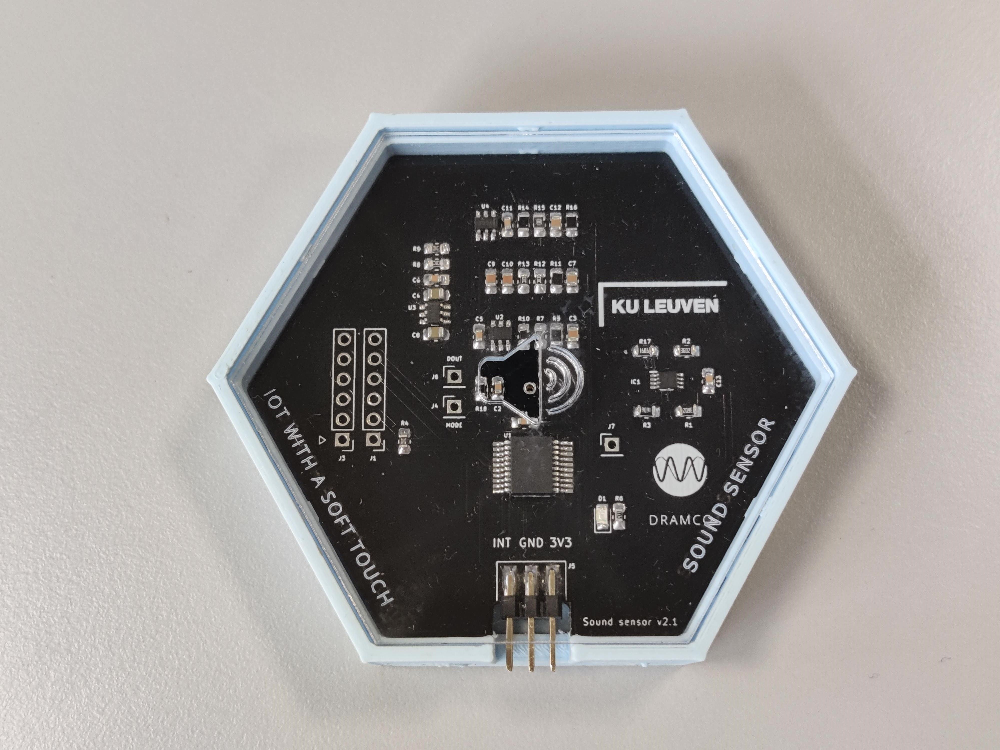

# Sound Sensor

This sensor measures the sound level.
You can measure it at fixed time intervals and/or transmit the value when
the level falls below or rises above a threshold. More information regarding thresholds see [this](../Configuration/what-are-thresholds.html).

Let op! Door de beperkte datastroom is het niet mogelijk geluid te streamen. De sensor geeft op regelmatige tijdsintervallen het gedetecteerde geluidsniveau door of geeft een signaal – naar de cloud – als een ingestelde drempelwaarde overschreden wordt.

Toepassingen:
- Monitoren van geluidsniveaus en/of geluidsoverlast
	* Bv. lawaai speelplaats monitoren
	* Bv. fuif van jeugdhuis te luid?
- Activiteitsdetectie:
	* Bv. is iemand aanwezig in een klaslokaal?

## Technical Information
The sound sensor contains a number of components:

### Microphone
A Vesper VM1010 is chosen because it is a low power microphone with a good performance. The microphone consumes 87 µA in active mode (measured). There is also a mode-pin to enable sleep-mode which reduces the current to approximately 5µA. To enable the sleep mode, one has to supply a low level voltage to the mode pin and vice versa. The sensitivity of the microphone equals -38 dBV while the frequency response curve is flat for the audible frequencies.

### High pass filter
The passive high pass filter has a -3dB-frequency of 100 Hz and removes the DC-offset of 0.8 V supplied by the microphone. Only 1 alternation of the sound wave is taken into account. This reduces the component cost and increases the stability of the circuit.

### Amplifier
An non-inverting amplifier is dimensioned to amplify the signal with 30 dB. A TLV341 is used as operational amplifier because it’s gain bandwidth product of 2.3 MHz is rather high. The quiescent current measures approximately 70 µA per channel.

### Low pass filter
A Sallen-Key low pass filter is dimensioned with a -3dB-frequency of 8 kHz to reduce the amplitude of the unwanted ultrasonic sounds. An amplification of 2.73 dB amplifies the signal to an amplitude which is appropriate for the ADC.

### Analog-to-digital converter
The 12 bit ADC of the PIC16F18446 samples the analog signal to 16-bit values with a sample frequency of 20 kHz. Because only 1 alternation is used, the ADC will measure the amplitude and not the peak-to-peak value. The PIC16F18446 will sample 1000 values to make sure the max value is approximated as close as possible to the real signal originating from the analog circuit. Whenever a threshold-value is exceeded, an interrupt will inform the motherboard that a dB value is ready.

### Communication
The microphone module communicates with the motherboard via I2C-commands to set the threshold value or timing interval.
